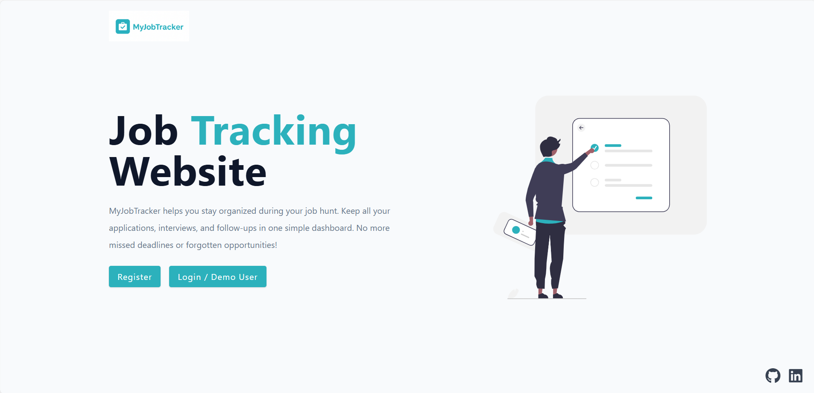
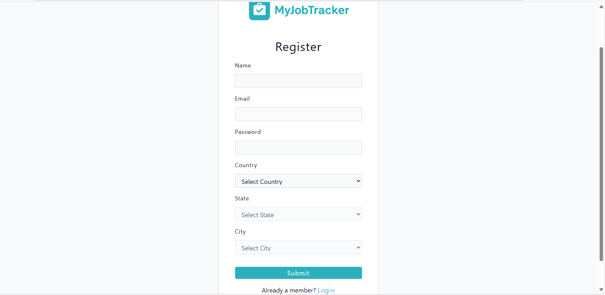
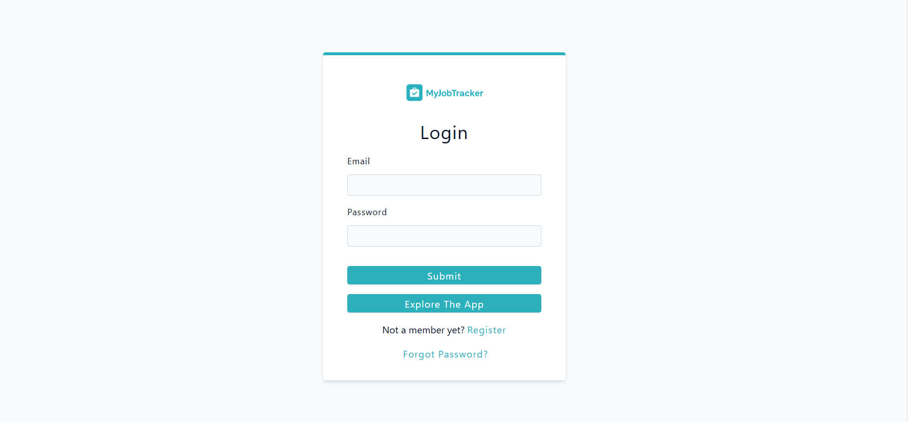
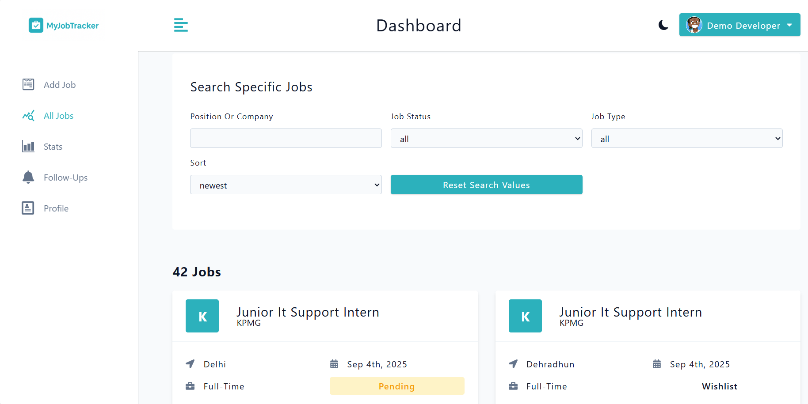
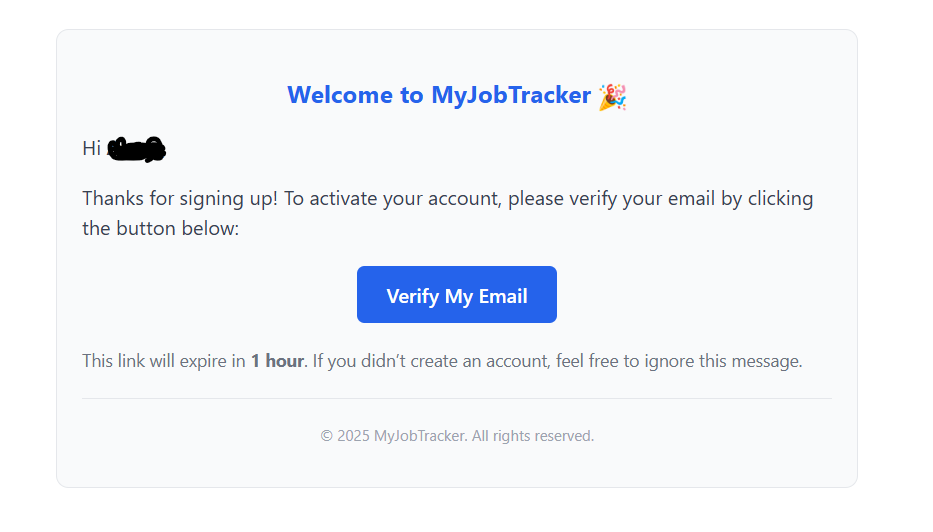
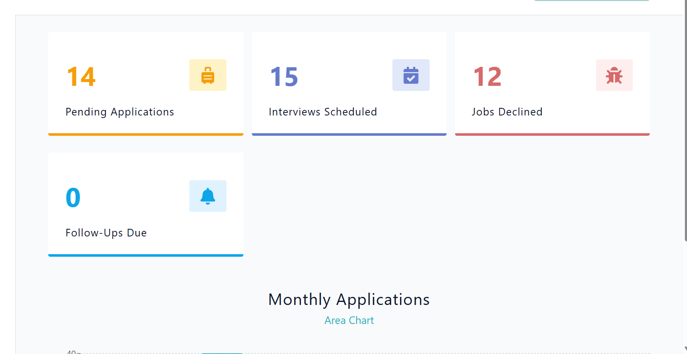
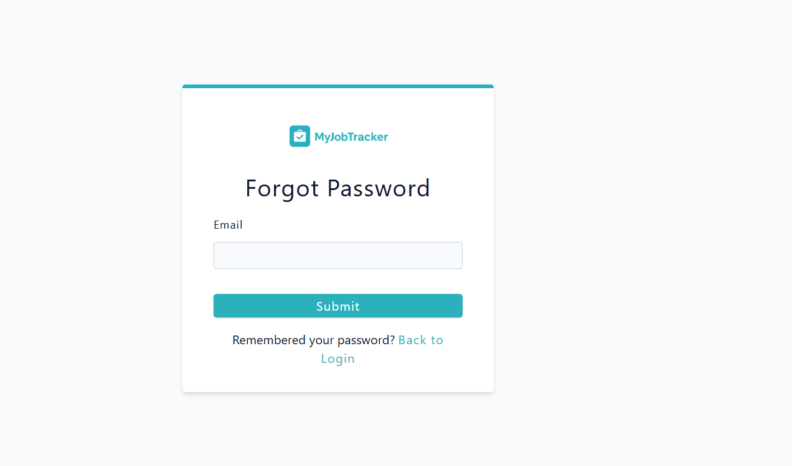

# 🧭 MyJobTracker

MyJobTracker is a full-stack job tracking application that helps users stay organized during their job hunt. It offers a clean dashboard to manage job applications, follow-ups, interviews, and analytics — all in one place.

## 🚀 Live Demo

👉 [Visit the live app](https://jobtracker-1-loaq.onrender.com)

Use the demo login or register your own account to explore the features.

---

## ✨ Features

- ✅ Add, edit, and delete job applications  
- ✅ Track job status: pending, interview, offer, declined  
- ✅ Smart follow-up reminders with snooze and mark-as-done  
- ✅ Email draft generation for follow-ups  
- ✅ Dashboard analytics with charts and stats  
- ✅ Profile management with avatar upload or auto-generated avatar  
- ✅ Pagination and filtering for large job lists  
- ✅ Responsive design for mobile and desktop  

---

## 🛠 Tech Stack

**Frontend**
- React (Vite)
- React Router
- Styled Components
- Recharts (for charts)
- React Query

**Backend**
- Node.js + Express
- MongoDB + Mongoose
- JWT Authentication
- RESTful API

**Deployment**
- Render (Frontend + Backend)
- Cloudinary (for avatar uploads)

---

## 📸 Screenshots

Below are sample screenshots of the application:

| Screenshot | Description |
|------------|-------------|
|  | Landing page |
|  | Register |
|  | Login overview |
|  | Job application all jobs |
|  | Add Jobs |
|  | Email Verification |
|  | Stats and charts |
|  | Forgot password |


---

## 🧑‍💻 Getting Started

```bash
# Clone the repo
git clone https://github.com/your-username/jobtracker.git

# Install dependencies
cd client
npm install

cd ../server
npm install

# Create .env files for both client and server
## 📜 License

This project is licensed under the [MIT License](https://opensource.org/licenses/MIT).


---

## 🙌 Credits

Built with ❤️ by Amit

---

## 💻 Code

This project is open-source and available for exploration, contribution, or inspiration.

# Start the app
npm run dev
