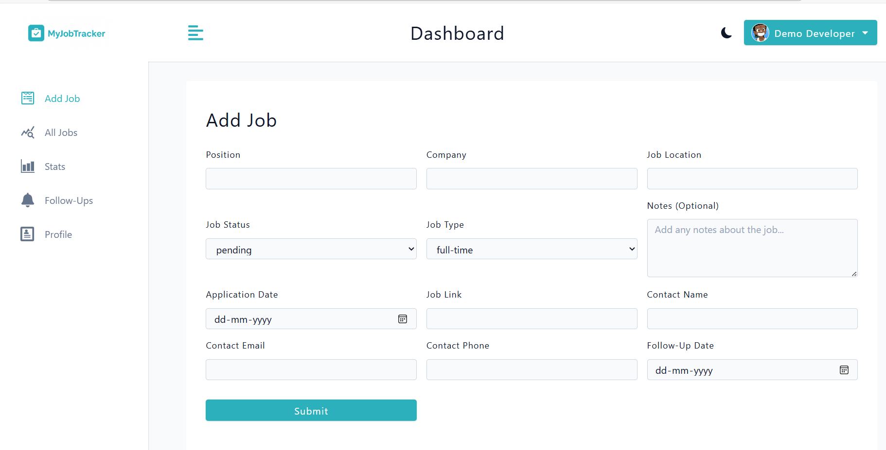

# 🧭 MyJobTracker

[](https://opensource.org/licenses/MIT) 
[](https://github.com/Kumar0Amit/JobTracker/releases) 
[](https://jobtracker-1-loaq.onrender.com) 

> A full-stack job tracking application to organize your job hunt.

---

## 📌 Project Summary

| Category | Details |
|----------|---------|
| **Project** | MyJobTracker |
| **Type** | Full-stack (MERN + Vite) |
| **Live Demo** | [Click Here](https://jobtracker-1-loaq.onrender.com) |
| **GitHub** | [Kumar0Amit/JobTracker](https://github.com/Kumar0Amit/JobTracker) |
| **Tech Stack** | React, Node.js, Express, MongoDB, JWT, Styled Components, Recharts |
| **Features** | Job tracking, Follow-ups, Analytics, Email drafts, Responsive UI |
| **License** | MIT |

> ⚡ Quick overview: Track job applications, manage follow-ups, visualize stats, and keep your job hunt organized in one place.

---

## 🗂 Table of Contents

- [🚀 Live Demo](#🚀-live-demo)  
- [✨ Features](#✨-features)  
- [🛠 Tech Stack](#🛠-tech-stack)  
- [📸 Screenshots](#📸-screenshots)  
- [🧑‍💻 Getting Started](#🧑‍💻-getting-started)  
- [📜 License](#📜-license)  
- [🙌 Credits](#🙌-credits)  
- [💻 Code](#💻-code)  
- [🤝 Contributing](#🤝-contributing)  
- [📬 Contact](#📬-contact)  

---

## 🚀 Live Demo

[](https://jobtracker-1-loaq.onrender.com)

Use the demo login or register your own account to explore the features.

---

## ✨ Features

- ✅ Add, edit, and delete job applications  
- ✅ Track job status: pending, interview, offer, declined  
- ✅ Smart follow-up reminders (snooze & mark-as-done)  
- ✅ Email draft generation for follow-ups  
- ✅ Dashboard analytics with charts and stats  
- ✅ Profile management with avatar upload or auto-generated avatar  
- ✅ Pagination and filtering for large job lists  
- ✅ Responsive design for mobile & desktop  

---

## 🛠 Tech Stack

**Frontend**  
-  React (Vite)  
-  React Router  
-  Styled Components  
-  Recharts  
-  React Query  

**Backend**  
-  Node.js + Express  
-  MongoDB + Mongoose  
-  JWT Authentication  
- RESTful API  

**Deployment**  
-  Render (Frontend + Backend)  
-  Cloudinary  

---

## 📸 Screenshots

| Screenshot | Description |
|------------|-------------|
|  | Landing page |
|  | Register |
|  | Login overview |
|  | Job application all jobs |
|  | Add Jobs |
|  | Email Verification |
|  | Stats and charts |
|  | Forgot password |

---

## 🧑‍💻 Getting Started

```bash
# Clone the repo
git clone https://github.com/Kumar0Amit/JobTracker.git

# Install dependencies
cd client
npm install
cd ../server
npm install

# Create .env files for both client and server

📜 License

MIT License

This project is open-source and free to use under the MIT License.
🙌 Credits

Built with ❤️ by Amit
GitHub: https://github.com/Kumar0Amit

💻 Code
# Start the app
npm run dev

🤝 Contributing

Contributions are welcome!

Fork the repository

Create a feature branch: git checkout -b feature/your-feature

Commit your changes: git commit -m "Add some feature"

Push to branch: git push origin feature/your-feature

Open a Pull Request

Follow Conventional Commits
 for consistent commit messages.

📬 Contact

GitHub: https://github.com/Kumar0Amit
